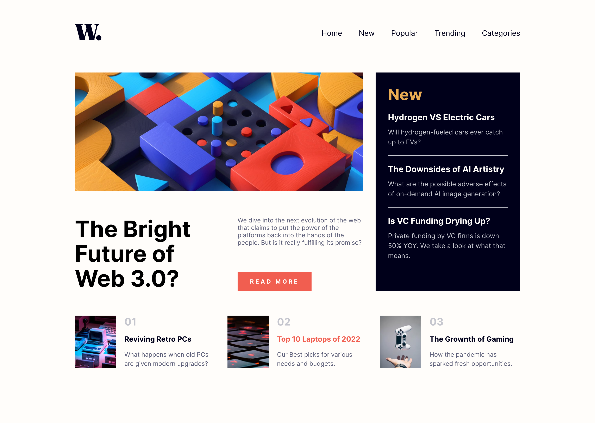

# Frontend Mentor - News homepage solution

This is a solution to the [News homepage challenge on Frontend Mentor](https://www.frontendmentor.io/challenges/news-homepage-H6SWTa1MFl). Frontend Mentor challenges help you improve your coding skills by building realistic projects. 

## Table of contents

- [Overview](#overview)
  - [The challenge](#the-challenge)
  - [Screenshot](#screenshot)
  - [Links](#links)
- [My process](#my-process)
  - [Built with](#built-with)
  - [Useful resources](#useful-resources)
- [Author](#author)

## Overview

### The challenge

Users should be able to:

- View the optimal layout for the interface depending on their device's screen size
- See hover and focus states for all interactive elements on the page

### Screenshot

### Links

- Solution URL: [https://wondrous-baklava-d5976c.netlify.app](https://wondrous-baklava-d5976c.netlify.app/)

## My process

### Built with

- Semantic HTML5 markup
- Scss
- BEM architecture
- Flexbox
- CSS Grid
- Mobile-first workflow

### Useful resources

- [sass-7-1-pattern.scss](https://gist.github.com/rveitch/84cea9650092119527bc) - This helped me for having a good sass architecture.

## Author

- Frontend Mentor - [@mehdilight](https://www.frontendmentor.io/profile/mehdilight)
- Twitter - [@mehdiislight](https://www.twitter.com/mehdilight)
